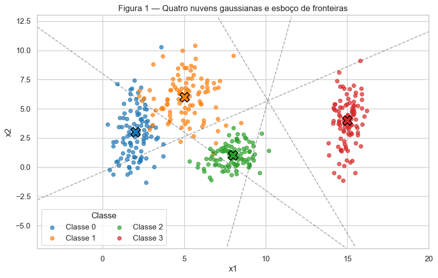
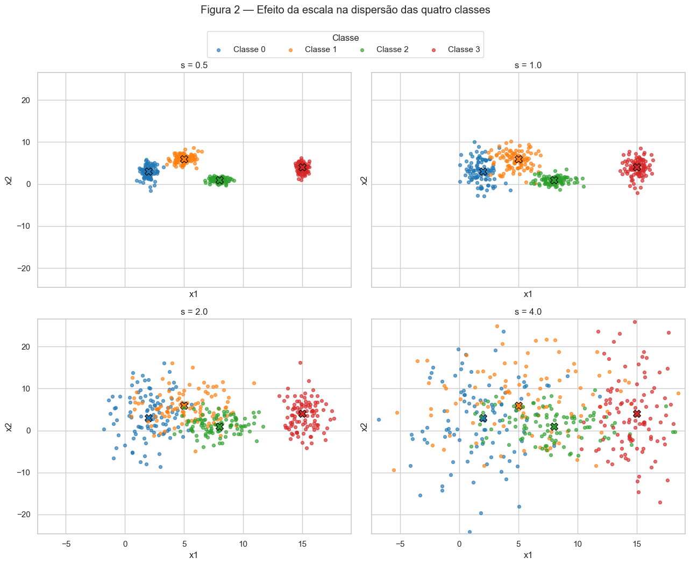
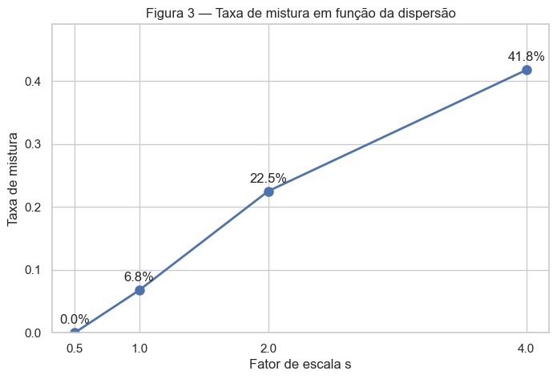
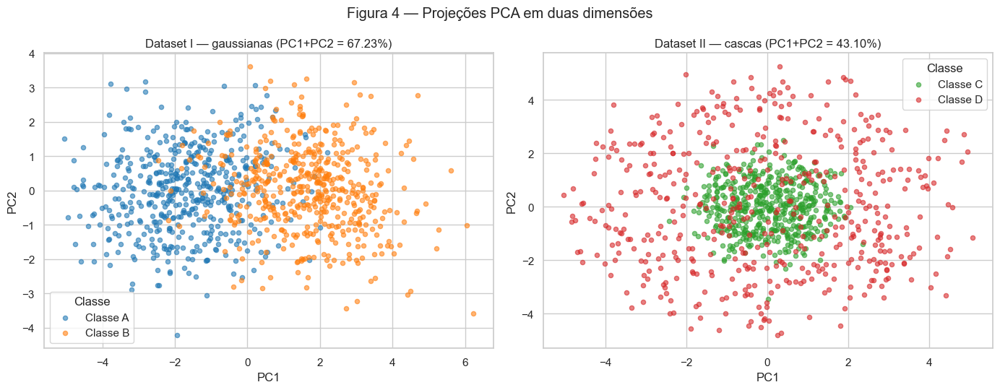
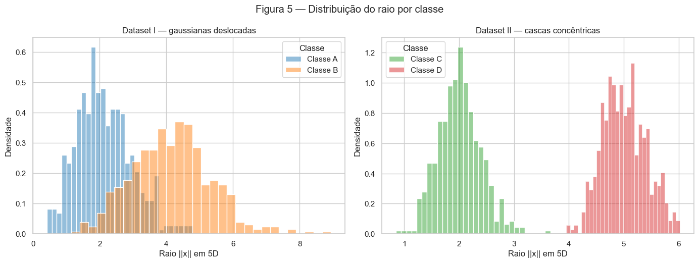
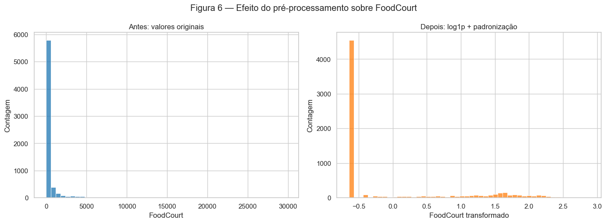

# Atividade 1 — Preparação e Análise de Dados para Redes Neurais

Solução dos três exercícios propostos em [1. Data](https://insper.github.io/ann-dl/2026.2/exercises/data/).

**Autoria e uso de IA.** Este relatório foi desenvolvido com colaboração do Codex (OpenAI). Para auxiliar no desenvolvimento dos códigos.


## Código reproduzível

O [notebook executado](code/Data.ipynb), o [conjunto de dados](code/train.csv)
e uma [versão em script](code/data_analysis.py) acompanham o relatório. O script
abaixo reúne, na mesma ordem, todas as células de código usadas para gerar os
resultados.

??? abstract "Código completo (`data_analysis.py`)"

    ```python
    --8<-- "docs/exercises/data/code/data_analysis.py"
    ```

## Exercise 1 — Nuvens de pontos: geometria e dispersão em 2D

### A — Geração das nuvens

Cada classe tem 100 observações. As coordenadas são independentes e seguem gaussianas com as médias e os desvios-padrão indicados no enunciado.


    

    


As linhas tracejadas são um **esboço**, não o resultado de um treinamento: são trechos das mediatrizes entre centros próximos. Elas representam regiões lineares por partes semelhantes às que uma rede poderia combinar para atribuir cada região do plano a uma classe.

### B — Mais ou menos dispersas

As médias permanecem fixas e todos os desvios-padrão são multiplicados por $s$. Cada painel abaixo é um conjunto de dados independente com quatro classes.


    

    


<style type="text/css">
</style>
<table id="T_d9aca">
  <thead>
    <tr>
      <th class="blank level0" >&nbsp;</th>
      <th id="T_d9aca_level0_col0" class="col_heading level0 col0" >Par</th>
      <th id="T_d9aca_level0_col1" class="col_heading level0 col1" >Distância entre médias</th>
      <th id="T_d9aca_level0_col2" class="col_heading level0 col2" >r_ij (s=1)</th>
    </tr>
  </thead>
  <tbody>
    <tr>
      <th id="T_d9aca_level0_row0" class="row_heading level0 row0" >0</th>
      <td id="T_d9aca_row0_col0" class="data row0 col0" >(0, 1)</td>
      <td id="T_d9aca_row0_col1" class="data row0 col1" >4.2426</td>
      <td id="T_d9aca_row0_col2" class="data row0 col2" >1.3258</td>
    </tr>
    <tr>
      <th id="T_d9aca_level0_row1" class="row_heading level0 row1" >1</th>
      <td id="T_d9aca_row1_col0" class="data row1 col0" >(1, 2)</td>
      <td id="T_d9aca_row1_col1" class="data row1 col1" >5.8310</td>
      <td id="T_d9aca_row1_col2" class="data row1 col2" >2.3800</td>
    </tr>
    <tr>
      <th id="T_d9aca_level0_row2" class="row_heading level0 row2" >2</th>
      <td id="T_d9aca_row2_col0" class="data row2 col0" >(0, 2)</td>
      <td id="T_d9aca_row2_col1" class="data row2 col1" >6.3246</td>
      <td id="T_d9aca_row2_col2" class="data row2 col2" >2.4802</td>
    </tr>
    <tr>
      <th id="T_d9aca_level0_row3" class="row_heading level0 row3" >3</th>
      <td id="T_d9aca_row3_col0" class="data row3 col0" >(2, 3)</td>
      <td id="T_d9aca_row3_col1" class="data row3 col1" >7.6158</td>
      <td id="T_d9aca_row3_col2" class="data row3 col2" >3.5422</td>
    </tr>
    <tr>
      <th id="T_d9aca_level0_row4" class="row_heading level0 row4" >4</th>
      <td id="T_d9aca_row4_col0" class="data row4 col0" >(1, 3)</td>
      <td id="T_d9aca_row4_col1" class="data row4 col1" >10.1980</td>
      <td id="T_d9aca_row4_col2" class="data row4 col2" >3.6422</td>
    </tr>
    <tr>
      <th id="T_d9aca_level0_row5" class="row_heading level0 row5" >5</th>
      <td id="T_d9aca_row5_col0" class="data row5 col0" >(0, 3)</td>
      <td id="T_d9aca_row5_col1" class="data row5 col1" >13.0384</td>
      <td id="T_d9aca_row5_col2" class="data row5 col2" >4.4960</td>
    </tr>
  </tbody>
</table>


A menor razão em $s=1$ é **1.3258**, para o par **(0, 1)**. Como $r_{ij}$ varia com $1/s$, em $s=2$ ela se torna **0.6629**, sem necessidade de gerar novos pontos.


<style type="text/css">
</style>
<table id="T_36436">
  <thead>
    <tr>
      <th class="blank level0" >&nbsp;</th>
      <th id="T_36436_level0_col0" class="col_heading level0 col0" >s</th>
      <th id="T_36436_level0_col1" class="col_heading level0 col1" >Taxa de mistura</th>
      <th id="T_36436_level0_col2" class="col_heading level0 col2" >Taxa de mistura (%)</th>
    </tr>
  </thead>
  <tbody>
    <tr>
      <th id="T_36436_level0_row0" class="row_heading level0 row0" >0</th>
      <td id="T_36436_row0_col0" class="data row0 col0" >0.500000</td>
      <td id="T_36436_row0_col1" class="data row0 col1" >0.0000</td>
      <td id="T_36436_row0_col2" class="data row0 col2" >0.00%</td>
    </tr>
    <tr>
      <th id="T_36436_level0_row1" class="row_heading level0 row1" >1</th>
      <td id="T_36436_row1_col0" class="data row1 col0" >1.000000</td>
      <td id="T_36436_row1_col1" class="data row1 col1" >0.0675</td>
      <td id="T_36436_row1_col2" class="data row1 col2" >6.75%</td>
    </tr>
    <tr>
      <th id="T_36436_level0_row2" class="row_heading level0 row2" >2</th>
      <td id="T_36436_row2_col0" class="data row2 col0" >2.000000</td>
      <td id="T_36436_row2_col1" class="data row2 col1" >0.2250</td>
      <td id="T_36436_row2_col2" class="data row2 col2" >22.50%</td>
    </tr>
    <tr>
      <th id="T_36436_level0_row3" class="row_heading level0 row3" >3</th>
      <td id="T_36436_row3_col0" class="data row3 col0" >4.000000</td>
      <td id="T_36436_row3_col1" class="data row3 col1" >0.4175</td>
      <td id="T_36436_row3_col2" class="data row3 col2" >41.75%</td>
    </tr>
  </tbody>
</table>


    

    


Nos dados gerados, a taxa de mistura já é diferente de zero em **s = 1** (6.75%). Porém, a perda visual clara da separação por regiões lineares ocorre a partir de **s = 2**, quando a menor razão de separação cai para **0.6629**. Em $s=4$, a mistura se torna ainda mais intensa.


### C — Análise

1. Em $s=1$, as classes 0 e 1 são as que mais se sobrepõem; também há alguma aproximação entre 1 e 2. **Uma única reta não separa quatro classes**, pois uma reta produz apenas dois semiplanos. Um conjunto de fronteiras lineares (por exemplo, uma regra multiclasse por centro mais próximo) consegue dividir grande parte do plano, mas os pontos nas caudas sobrepostas são inevitavelmente ambíguos e não podem ser todos separados sem erro por fronteiras simples.

2. A Figura 1 inclui o esboço pedido: as mediatrizes tracejadas particionam o plano em regiões associadas aos centros. Uma rede poderia aprender uma versão deslocada e linear por partes dessas fronteiras, adaptando-a às densidades observadas.

3. Quando $s$ aumenta, as caudas das classes passam a ocupar as mesmas regiões. A faixa em torno das fronteiras cresce e, com ela, cresce a região em que até uma boa rede necessariamente cometerá erros: entradas muito parecidas passam a ter rótulos diferentes. Isso é coerente com a queda de $r_{ij}$ e com o aumento da taxa de mistura.

## Exercise 2 — Não linearidade em dimensões maiores

### A — Dataset I: gaussianas deslocadas

São geradas 500 amostras por classe em cinco dimensões com as médias e matrizes de covariância especificadas.

    Dataset I: (1000, 5) — 500 amostras em cada classe


### B — Dataset II: cascas concêntricas

As direções são gaussianas normalizadas para a esfera unitária de $\mathbb{R}^5$. O raio da classe C se concentra em 2 e o da classe D em 5.

    Dataset II: (1000, 5) — 500 amostras em cada classe


### C — Visualização e comparação

Cada PCA é ajustado separadamente ao respectivo conjunto completo, sem usar os rótulos. A soma da variância explicada por PC1 e PC2 mede quanta variabilidade total foi retida, não a qualidade de um classificador.


    

    


A variância explicada por PC1+PC2 é **67.23%** no Dataset I e **43.10%** no Dataset II. No Dataset I, a projeção preserva melhor a informação relevante para classificação, pois o deslocamento entre médias é uma direção linear de alta variância. No Dataset II, a informação está no raio em 5D e não em uma direção linear específica.


    

    


A distância empírica entre os centros é **3.4053** no Dataset I e **0.2347** no Dataset II.


### D — Análise

1. No Dataset II, os centros praticamente coincidem, mas os raios ocupam intervalos bem diferentes. Portanto, a classe não depende do lado de um hiperplano em que o ponto está; depende da sua distância à origem. Um hiperplano pode cortar uma casca, mas não envolver o núcleo em todas as direções.

2. Coletar mais dados apenas preenche melhor todas as direções das duas cascas. Como as classes são invariantes à direção e diferem radialmente, não existe vetor $w$ e limiar $b$ tais que o sinal de $w^Tx+b$ separe interior e exterior em toda a esfera. A fronteira apropriada é aproximadamente esférica, portanto não linear.

3. Uma projeção PCA 2D aparentemente misturada **não prova** inseparabilidade no espaço original: PCA é linear, não usa os rótulos e descarta três dimensões. Isso aparece aqui porque o Dataset II parece misturado na projeção, apesar de seus histogramas de raio em 5D serem quase disjuntos. Uma função separadora simples é

$$
f(x)=\sum_{i=1}^{5}x_i^2-c,
$$

com $c$ entre $2^2$ e $5^2$ (por exemplo, $c=12{,}25$, equivalente a um raio-limite de 3,5). Classificamos como D quando $f(x)>0$ e como C caso contrário.


Com limiar radial 3,5, essa função separa **99.90%** das amostras geradas.


## Exercise 3 — Preparando dados reais para uma rede neural

### A — Conhecendo os dados

O arquivo `train.csv` vem da competição **Spaceship Titanic** do Kaggle. O objetivo é prever `Transported`: se cada passageiro foi transportado para outra dimensão após a colisão com a anomalia. O arquivo é carregado localmente para que o relatório seja reproduzível.


<div>
<style scoped>
    .dataframe tbody tr th:only-of-type {
        vertical-align: middle;
    }

    .dataframe tbody tr th {
        vertical-align: top;
    }

    .dataframe thead th {
        text-align: right;
    }
</style>
<table border="1" class="dataframe">
  <thead>
    <tr style="text-align: right;">
      <th></th>
      <th>PassengerId</th>
      <th>HomePlanet</th>
      <th>CryoSleep</th>
      <th>Cabin</th>
      <th>Destination</th>
      <th>Age</th>
      <th>VIP</th>
      <th>RoomService</th>
      <th>FoodCourt</th>
      <th>ShoppingMall</th>
      <th>Spa</th>
      <th>VRDeck</th>
      <th>Name</th>
      <th>Transported</th>
    </tr>
  </thead>
  <tbody>
    <tr>
      <th>0</th>
      <td>0001_01</td>
      <td>Europa</td>
      <td>False</td>
      <td>B/0/P</td>
      <td>TRAPPIST-1e</td>
      <td>39.0000</td>
      <td>False</td>
      <td>0.0000</td>
      <td>0.0000</td>
      <td>0.0000</td>
      <td>0.0000</td>
      <td>0.0000</td>
      <td>Maham Ofracculy</td>
      <td>False</td>
    </tr>
    <tr>
      <th>1</th>
      <td>0002_01</td>
      <td>Earth</td>
      <td>False</td>
      <td>F/0/S</td>
      <td>TRAPPIST-1e</td>
      <td>24.0000</td>
      <td>False</td>
      <td>109.0000</td>
      <td>9.0000</td>
      <td>25.0000</td>
      <td>549.0000</td>
      <td>44.0000</td>
      <td>Juanna Vines</td>
      <td>True</td>
    </tr>
    <tr>
      <th>2</th>
      <td>0003_01</td>
      <td>Europa</td>
      <td>False</td>
      <td>A/0/S</td>
      <td>TRAPPIST-1e</td>
      <td>58.0000</td>
      <td>True</td>
      <td>43.0000</td>
      <td>3,576.0000</td>
      <td>0.0000</td>
      <td>6,715.0000</td>
      <td>49.0000</td>
      <td>Altark Susent</td>
      <td>False</td>
    </tr>
    <tr>
      <th>3</th>
      <td>0003_02</td>
      <td>Europa</td>
      <td>False</td>
      <td>A/0/S</td>
      <td>TRAPPIST-1e</td>
      <td>33.0000</td>
      <td>False</td>
      <td>0.0000</td>
      <td>1,283.0000</td>
      <td>371.0000</td>
      <td>3,329.0000</td>
      <td>193.0000</td>
      <td>Solam Susent</td>
      <td>False</td>
    </tr>
    <tr>
      <th>4</th>
      <td>0004_01</td>
      <td>Earth</td>
      <td>False</td>
      <td>F/1/S</td>
      <td>TRAPPIST-1e</td>
      <td>16.0000</td>
      <td>False</td>
      <td>303.0000</td>
      <td>70.0000</td>
      <td>151.0000</td>
      <td>565.0000</td>
      <td>2.0000</td>
      <td>Willy Santantines</td>
      <td>True</td>
    </tr>
  </tbody>
</table>
</div>


    Dimensão original: (8693, 14)


<style type="text/css">
</style>
<table id="T_04aaa">
  <thead>
    <tr>
      <th class="blank level0" >&nbsp;</th>
      <th id="T_04aaa_level0_col0" class="col_heading level0 col0" >Contagem</th>
      <th id="T_04aaa_level0_col1" class="col_heading level0 col1" >Percentual</th>
    </tr>
    <tr>
      <th class="index_name level0" >Transported</th>
      <th class="blank col0" >&nbsp;</th>
      <th class="blank col1" >&nbsp;</th>
    </tr>
  </thead>
  <tbody>
    <tr>
      <th id="T_04aaa_level0_row0" class="row_heading level0 row0" >True</th>
      <td id="T_04aaa_row0_col0" class="data row0 col0" >4378</td>
      <td id="T_04aaa_row0_col1" class="data row0 col1" >50.36%</td>
    </tr>
    <tr>
      <th id="T_04aaa_level0_row1" class="row_heading level0 row1" >False</th>
      <td id="T_04aaa_row1_col0" class="data row1 col0" >4315</td>
      <td id="T_04aaa_row1_col1" class="data row1 col1" >49.64%</td>
    </tr>
  </tbody>
</table>


A classe positiva (`Transported=True`) corresponde a **50.36%** dos passageiros; as classes são praticamente balanceadas.


As variáveis são separadas pelo significado:

- **Numéricas:** `Age`, `RoomService`, `FoodCourt`, `ShoppingMall`, `Spa`, `VRDeck`.
- **Categóricas/binárias:** `HomePlanet`, `CryoSleep`, `Cabin`, `Destination`, `VIP`, `Name` e `PassengerId`. Embora os três últimos identificadores sejam armazenados como texto, `PassengerId`, `Name` e `Cabin` serão descartados porque têm cardinalidade alta e exigiriam engenharia específica. `Transported` é o alvo, não uma feature.


<style type="text/css">
</style>
<table id="T_b6a01">
  <thead>
    <tr>
      <th class="blank level0" >&nbsp;</th>
      <th id="T_b6a01_level0_col0" class="col_heading level0 col0" >Ausentes</th>
      <th id="T_b6a01_level0_col1" class="col_heading level0 col1" >Percentual</th>
    </tr>
  </thead>
  <tbody>
    <tr>
      <th id="T_b6a01_level0_row0" class="row_heading level0 row0" >CryoSleep</th>
      <td id="T_b6a01_row0_col0" class="data row0 col0" >217</td>
      <td id="T_b6a01_row0_col1" class="data row0 col1" >2.50%</td>
    </tr>
    <tr>
      <th id="T_b6a01_level0_row1" class="row_heading level0 row1" >ShoppingMall</th>
      <td id="T_b6a01_row1_col0" class="data row1 col0" >208</td>
      <td id="T_b6a01_row1_col1" class="data row1 col1" >2.39%</td>
    </tr>
    <tr>
      <th id="T_b6a01_level0_row2" class="row_heading level0 row2" >VIP</th>
      <td id="T_b6a01_row2_col0" class="data row2 col0" >203</td>
      <td id="T_b6a01_row2_col1" class="data row2 col1" >2.34%</td>
    </tr>
    <tr>
      <th id="T_b6a01_level0_row3" class="row_heading level0 row3" >HomePlanet</th>
      <td id="T_b6a01_row3_col0" class="data row3 col0" >201</td>
      <td id="T_b6a01_row3_col1" class="data row3 col1" >2.31%</td>
    </tr>
    <tr>
      <th id="T_b6a01_level0_row4" class="row_heading level0 row4" >Name</th>
      <td id="T_b6a01_row4_col0" class="data row4 col0" >200</td>
      <td id="T_b6a01_row4_col1" class="data row4 col1" >2.30%</td>
    </tr>
    <tr>
      <th id="T_b6a01_level0_row5" class="row_heading level0 row5" >Cabin</th>
      <td id="T_b6a01_row5_col0" class="data row5 col0" >199</td>
      <td id="T_b6a01_row5_col1" class="data row5 col1" >2.29%</td>
    </tr>
    <tr>
      <th id="T_b6a01_level0_row6" class="row_heading level0 row6" >VRDeck</th>
      <td id="T_b6a01_row6_col0" class="data row6 col0" >188</td>
      <td id="T_b6a01_row6_col1" class="data row6 col1" >2.16%</td>
    </tr>
    <tr>
      <th id="T_b6a01_level0_row7" class="row_heading level0 row7" >FoodCourt</th>
      <td id="T_b6a01_row7_col0" class="data row7 col0" >183</td>
      <td id="T_b6a01_row7_col1" class="data row7 col1" >2.11%</td>
    </tr>
    <tr>
      <th id="T_b6a01_level0_row8" class="row_heading level0 row8" >Spa</th>
      <td id="T_b6a01_row8_col0" class="data row8 col0" >183</td>
      <td id="T_b6a01_row8_col1" class="data row8 col1" >2.11%</td>
    </tr>
    <tr>
      <th id="T_b6a01_level0_row9" class="row_heading level0 row9" >Destination</th>
      <td id="T_b6a01_row9_col0" class="data row9 col0" >182</td>
      <td id="T_b6a01_row9_col1" class="data row9 col1" >2.09%</td>
    </tr>
    <tr>
      <th id="T_b6a01_level0_row10" class="row_heading level0 row10" >RoomService</th>
      <td id="T_b6a01_row10_col0" class="data row10 col0" >181</td>
      <td id="T_b6a01_row10_col1" class="data row10 col1" >2.08%</td>
    </tr>
    <tr>
      <th id="T_b6a01_level0_row11" class="row_heading level0 row11" >Age</th>
      <td id="T_b6a01_row11_col0" class="data row11 col0" >179</td>
      <td id="T_b6a01_row11_col1" class="data row11 col1" >2.06%</td>
    </tr>
    <tr>
      <th id="T_b6a01_level0_row12" class="row_heading level0 row12" >PassengerId</th>
      <td id="T_b6a01_row12_col0" class="data row12 col0" >0</td>
      <td id="T_b6a01_row12_col1" class="data row12 col1" >0.00%</td>
    </tr>
    <tr>
      <th id="T_b6a01_level0_row13" class="row_heading level0 row13" >Transported</th>
      <td id="T_b6a01_row13_col0" class="data row13 col0" >0</td>
      <td id="T_b6a01_row13_col1" class="data row13 col1" >0.00%</td>
    </tr>
  </tbody>
</table>


<style type="text/css">
</style>
<table id="T_cfefb">
  <thead>
    <tr>
      <th class="blank level0" >&nbsp;</th>
      <th id="T_cfefb_level0_col0" class="col_heading level0 col0" >Média</th>
      <th id="T_cfefb_level0_col1" class="col_heading level0 col1" >Mediana</th>
      <th id="T_cfefb_level0_col2" class="col_heading level0 col2" >Máximo</th>
    </tr>
  </thead>
  <tbody>
    <tr>
      <th id="T_cfefb_level0_row0" class="row_heading level0 row0" >RoomService</th>
      <td id="T_cfefb_row0_col0" class="data row0 col0" >224.69</td>
      <td id="T_cfefb_row0_col1" class="data row0 col1" >0.00</td>
      <td id="T_cfefb_row0_col2" class="data row0 col2" >14,327.00</td>
    </tr>
    <tr>
      <th id="T_cfefb_level0_row1" class="row_heading level0 row1" >FoodCourt</th>
      <td id="T_cfefb_row1_col0" class="data row1 col0" >458.08</td>
      <td id="T_cfefb_row1_col1" class="data row1 col1" >0.00</td>
      <td id="T_cfefb_row1_col2" class="data row1 col2" >29,813.00</td>
    </tr>
    <tr>
      <th id="T_cfefb_level0_row2" class="row_heading level0 row2" >ShoppingMall</th>
      <td id="T_cfefb_row2_col0" class="data row2 col0" >173.73</td>
      <td id="T_cfefb_row2_col1" class="data row2 col1" >0.00</td>
      <td id="T_cfefb_row2_col2" class="data row2 col2" >23,492.00</td>
    </tr>
    <tr>
      <th id="T_cfefb_level0_row3" class="row_heading level0 row3" >Spa</th>
      <td id="T_cfefb_row3_col0" class="data row3 col0" >311.14</td>
      <td id="T_cfefb_row3_col1" class="data row3 col1" >0.00</td>
      <td id="T_cfefb_row3_col2" class="data row3 col2" >22,408.00</td>
    </tr>
    <tr>
      <th id="T_cfefb_level0_row4" class="row_heading level0 row4" >VRDeck</th>
      <td id="T_cfefb_row4_col0" class="data row4 col0" >304.85</td>
      <td id="T_cfefb_row4_col1" class="data row4 col1" >0.00</td>
      <td id="T_cfefb_row4_col2" class="data row4 col2" >24,133.00</td>
    </tr>
  </tbody>
</table>


Em todas as variáveis de gasto, a média é muito maior que a mediana (frequentemente zero), enquanto o máximo fica muito distante de ambas. Isso revela distribuições fortemente assimétricas à direita e com caudas pesadas: a maioria dos passageiros gasta pouco ou nada, e poucos passageiros têm valores extremos.

### B — Divisão antes das transformações

A divisão 80/20 é estratificada pelo alvo e usa semente fixa. Ela ocorre antes de imputação, criação de categorias e escala porque mediana, categorias observadas, média e desvio-padrão devem ser estimados somente com o treino. Usar o conjunto completo revelaria ao pipeline informação do teste, causando *data leakage* e uma avaliação excessivamente otimista.

    Treino: (6954, 13) Teste: (1739, 13)
    Positivos — treino: 50.36% teste: 50.37%


No treino, antes das transformações, `FoodCourt` tem média **452.61** e mediana **0.00**.


### C — Pré-processamento

Estratégia:

- variáveis numéricas recebem a mediana do **treino**, robusta às caudas pesadas;
- variáveis categóricas recebem a moda do **treino**;
- o one-hot usa `handle_unknown='ignore'`, então uma categoria inédita no teste produz zeros nas colunas conhecidas em vez de erro;
- após imputar os cinco gastos, `TotalSpend` é criado como sua soma;
- aplica-se $\log(1+x)$ aos cinco gastos e a `TotalSpend`, comprimindo valores extremos;
- as sete variáveis numéricas são padronizadas com média 0 e desvio-padrão 1 usando somente o treino. A padronização mantém a maior parte dos valores perto da região não saturada da `tanh`.

    Features finais:
    ['Age', 'RoomService', 'FoodCourt', 'ShoppingMall', 'Spa', 'VRDeck', 'TotalSpend', 'HomePlanet_Earth', 'HomePlanet_Europa', 'HomePlanet_Mars', 'CryoSleep_False', 'CryoSleep_True', 'Destination_55 Cancri e', 'Destination_PSO J318.5-22', 'Destination_TRAPPIST-1e', 'VIP_False', 'VIP_True']


### D — Verificação e visualização

A Figura 6 usa exatamente os registros do treino. À esquerda está `FoodCourt` antes do pré-processamento (ignorando ausentes apenas para desenhar); à direita está a mesma feature após imputação, `log1p` e padronização.


    

    


<style type="text/css">
</style>
<table id="T_5836e">
  <thead>
    <tr>
      <th class="blank level0" >&nbsp;</th>
      <th id="T_5836e_level0_col0" class="col_heading level0 col0" >Conjunto</th>
      <th id="T_5836e_level0_col1" class="col_heading level0 col1" >Shape</th>
      <th id="T_5836e_level0_col2" class="col_heading level0 col2" >NaN restantes</th>
      <th id="T_5836e_level0_col3" class="col_heading level0 col3" >Mínimo</th>
      <th id="T_5836e_level0_col4" class="col_heading level0 col4" >Máximo</th>
    </tr>
  </thead>
  <tbody>
    <tr>
      <th id="T_5836e_level0_row0" class="row_heading level0 row0" >0</th>
      <td id="T_5836e_row0_col0" class="data row0 col0" >Treino</td>
      <td id="T_5836e_row0_col1" class="data row0 col1" >(6954, 17)</td>
      <td id="T_5836e_row0_col2" class="data row0 col2" >0</td>
      <td id="T_5836e_row0_col3" class="data row0 col3" >-1.9961</td>
      <td id="T_5836e_row0_col4" class="data row0 col4" >3.5080</td>
    </tr>
    <tr>
      <th id="T_5836e_level0_row1" class="row_heading level0 row1" >1</th>
      <td id="T_5836e_row1_col0" class="data row1 col0" >Teste</td>
      <td id="T_5836e_row1_col1" class="data row1 col1" >(1739, 17)</td>
      <td id="T_5836e_row1_col2" class="data row1 col2" >0</td>
      <td id="T_5836e_row1_col3" class="data row1 col3" >-1.9961</td>
      <td id="T_5836e_row1_col4" class="data row1 col4" >3.3687</td>
    </tr>
  </tbody>
</table>


As matrizes finais têm **zero NaN**. O treino tem shape **(6954, 17)** e varia de **-1.9961** a **3.5080**; o teste tem shape **(1739, 17)** e varia de **-1.9961** a **3.3687**. As variáveis contínuas foram centradas e padronizadas; as one-hot ficam em 0 ou 1. A padronização não limita rigidamente o intervalo, mas concentra a maioria dos valores perto de zero, uma escala adequada para `tanh`.


#### Reflexão

A combinação de `log1p` com padronização provavelmente tem o maior efeito no treinamento. Sem o log, os poucos gastos extremos dominariam a média, a variância e os gradientes; depois da escala, a maioria dos exemplos poderia ficar comprimida numa região pouco informativa enquanto alguns outliers levariam ativações `tanh` à saturação. O log reduz a assimetria antes de o `StandardScaler` ser ajustado, deixando diferenças entre gastos baixos mais visíveis e tornando a otimização numericamente mais estável. A divisão antes de qualquer ajuste é igualmente indispensável para que essa conclusão e uma futura avaliação sejam válidas.

## Results summary

A tabela abaixo reúne os números já calculados nas seções anteriores, conforme solicitado.


<style type="text/css">
</style>
<table id="T_7569c">
  <thead>
    <tr>
      <th id="T_7569c_level0_col0" class="col_heading level0 col0" >#</th>
      <th id="T_7569c_level0_col1" class="col_heading level0 col1" >Item</th>
      <th id="T_7569c_level0_col2" class="col_heading level0 col2" >Valor</th>
    </tr>
  </thead>
  <tbody>
    <tr>
      <td id="T_7569c_row0_col0" class="data row0 col0" >1</td>
      <td id="T_7569c_row0_col1" class="data row0 col1" >Taxa de mistura em s = 0.5</td>
      <td id="T_7569c_row0_col2" class="data row0 col2" >0.0000 (0.00%)</td>
    </tr>
    <tr>
      <td id="T_7569c_row1_col0" class="data row1 col0" >2</td>
      <td id="T_7569c_row1_col1" class="data row1 col1" >Taxa de mistura em s = 1.0</td>
      <td id="T_7569c_row1_col2" class="data row1 col2" >0.0675 (6.75%)</td>
    </tr>
    <tr>
      <td id="T_7569c_row2_col0" class="data row2 col0" >3</td>
      <td id="T_7569c_row2_col1" class="data row2 col1" >Taxa de mistura em s = 2.0</td>
      <td id="T_7569c_row2_col2" class="data row2 col2" >0.2250 (22.50%)</td>
    </tr>
    <tr>
      <td id="T_7569c_row3_col0" class="data row3 col0" >4</td>
      <td id="T_7569c_row3_col1" class="data row3 col1" >Taxa de mistura em s = 4.0</td>
      <td id="T_7569c_row3_col2" class="data row3 col2" >0.4175 (41.75%)</td>
    </tr>
    <tr>
      <td id="T_7569c_row4_col0" class="data row4 col0" >5</td>
      <td id="T_7569c_row4_col1" class="data row4 col1" >Menor r_ij em s = 1.0 e par</td>
      <td id="T_7569c_row4_col2" class="data row4 col2" >1.3258, par (0, 1)</td>
    </tr>
    <tr>
      <td id="T_7569c_row5_col0" class="data row5 col0" >6</td>
      <td id="T_7569c_row5_col1" class="data row5 col1" >Distância entre centros — Dataset I</td>
      <td id="T_7569c_row5_col2" class="data row5 col2" >3.4053</td>
    </tr>
    <tr>
      <td id="T_7569c_row6_col0" class="data row6 col0" >7</td>
      <td id="T_7569c_row6_col1" class="data row6 col1" >Distância entre centros — Dataset II</td>
      <td id="T_7569c_row6_col2" class="data row6 col2" >0.2347</td>
    </tr>
    <tr>
      <td id="T_7569c_row7_col0" class="data row7 col0" >8</td>
      <td id="T_7569c_row7_col1" class="data row7 col1" >Variância explicada PC1 + PC2 — Dataset I</td>
      <td id="T_7569c_row7_col2" class="data row7 col2" >0.6723 (67.23%)</td>
    </tr>
    <tr>
      <td id="T_7569c_row8_col0" class="data row8 col0" >9</td>
      <td id="T_7569c_row8_col1" class="data row8 col1" >Variância explicada PC1 + PC2 — Dataset II</td>
      <td id="T_7569c_row8_col2" class="data row8 col2" >0.4310 (43.10%)</td>
    </tr>
    <tr>
      <td id="T_7569c_row9_col0" class="data row9 col0" >10</td>
      <td id="T_7569c_row9_col1" class="data row9 col1" >Participação da classe positiva em Transported</td>
      <td id="T_7569c_row9_col2" class="data row9 col2" >0.5036 (50.36%)</td>
    </tr>
    <tr>
      <td id="T_7569c_row10_col0" class="data row10 col0" >11</td>
      <td id="T_7569c_row10_col1" class="data row10 col1" >Média e mediana de FoodCourt no treino, antes</td>
      <td id="T_7569c_row10_col2" class="data row10 col2" >452.61; 0.00</td>
    </tr>
    <tr>
      <td id="T_7569c_row11_col0" class="data row11 col0" >12</td>
      <td id="T_7569c_row11_col1" class="data row11 col1" >Shape final da matriz de treino</td>
      <td id="T_7569c_row11_col2" class="data row11 col2" >(6954, 17)</td>
    </tr>
    <tr>
      <td id="T_7569c_row12_col0" class="data row12 col0" >13</td>
      <td id="T_7569c_row12_col1" class="data row12 col1" >Mínimo e máximo após escala — treino; teste</td>
      <td id="T_7569c_row12_col2" class="data row12 col2" >treino [-1.9961, 3.5080]; teste [-1.9961, 3.3687]</td>
    </tr>
  </tbody>
</table>


