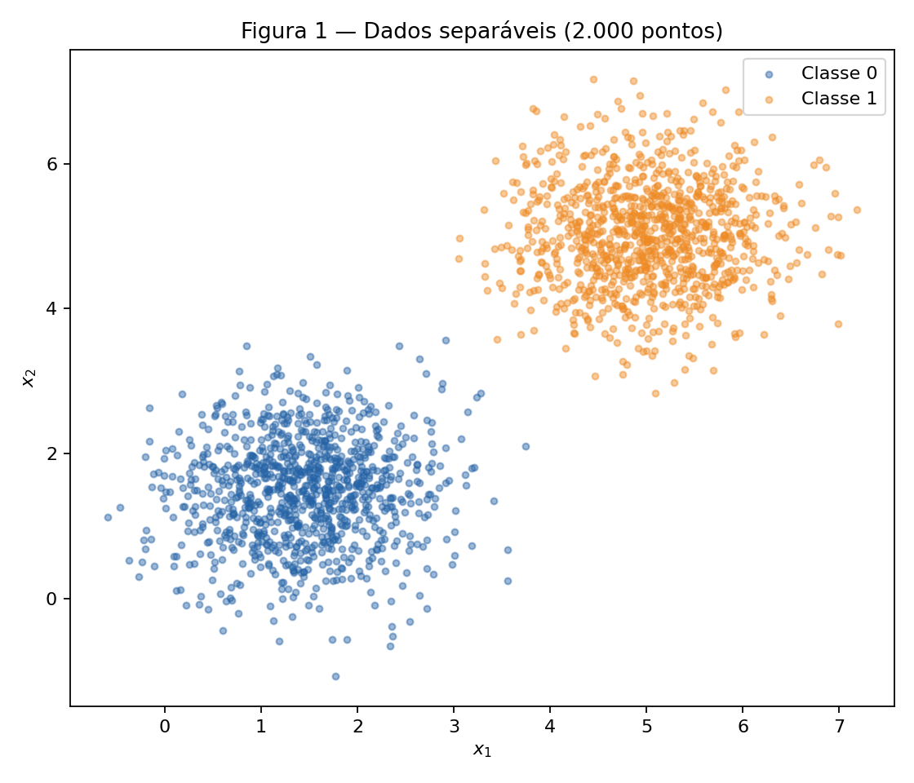
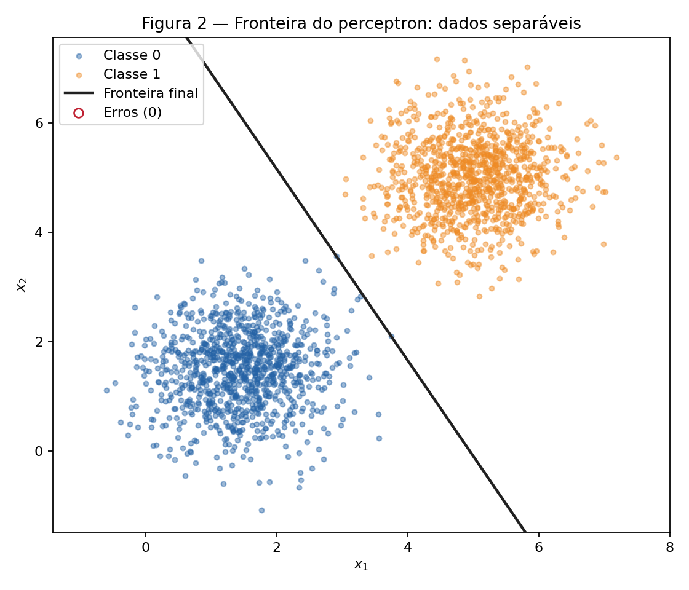
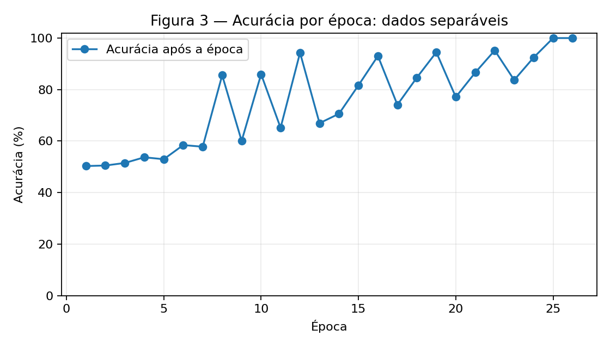
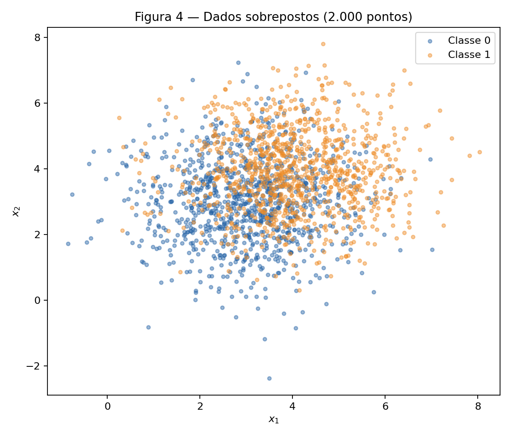
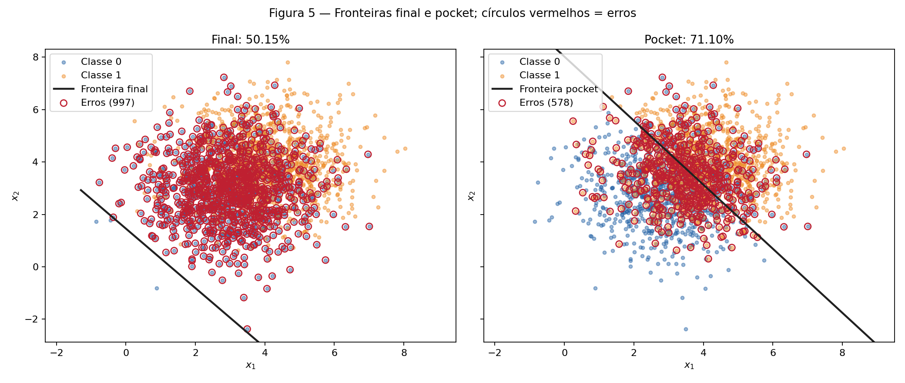
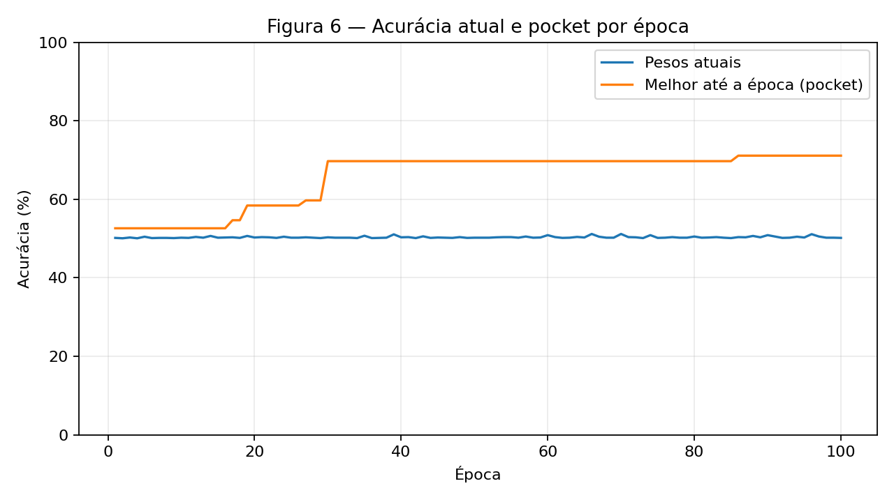

# Atividade 2 — Perceptron e seus limites

**Autoria e uso de IA.** Este relatório foi desenvolvido com colaboração do Codex (OpenAI). Para auxiliar no desenvolvimento dos códigos.

Solução de [2. Perceptron](https://insper.github.io/ann-dl/2026.2/exercises/perceptron/). O mesmo algoritmo é treinado em dados separáveis e sobrepostos para observar a diferença entre convergência e oscilação. Foi usado `rng = np.random.default_rng(42)` durante todo o experimento. São 1.000 observações por classe, em ordem classe 0 seguida de classe 1, sem embaralhamento. No teste das duas taxas de aprendizado, o **mesmo vetor inicial** foi reutilizado para isolar o efeito de $\eta$.

**Abordagem e desafio.** O perceptron usa ativação linear, degrau em zero e atualizações amostra a amostra com erro $y-\hat y$. Com dados sobrepostos, o desafio foi medir a acurácia após *cada atualização* para copiar o melhor estado (pocket), sem confundi-lo com os pesos ao fim da última época. A ordem dos dados afeta esses últimos pesos; por isso, ela e a semente são fixas. As acurácias deste relatório são medidas **no próprio conjunto gerado**, como pede o enunciado, e não estimativas em dados externos.

## Código reproduzível

Os notebooks executáveis são [Exercise 1](code/Exercise1.ipynb) e [Exercise 2](code/Exercise2.ipynb). A implementação compartilhada está em [`perceptron.py`](code/perceptron.py), e [`run_analysis.py`](code/run_analysis.py) regenera as seis figuras e [`results.json`](code/results.json):

```bash
python docs/exercises/perceptron/code/run_analysis.py
```

??? abstract "Implementação completa (`perceptron.py`)"

    ```python
    --8<-- "docs/exercises/perceptron/code/perceptron.py"
    ```

??? abstract "Geração das figuras (`run_analysis.py`)"

    ```python
    --8<-- "docs/exercises/perceptron/code/run_analysis.py"
    ```

## Exercise 1 — Dados separáveis

### A — Generate the data

A classe 0 foi sorteada de $\mathcal N([1{,}5,1{,}5],0{,}5I)$ e a classe 1 de $\mathcal N([5,5],0{,}5I)$. O conjunto tem 2.000 pontos, sendo 1.000 por classe. As nuvens ficam suficientemente afastadas para uma reta separar esta amostra.



### B — Implement the perceptron

A predição é $\hat y=\mathbf 1[\mathbf w\cdot\mathbf x+b\geq0]$. Em cada amostra, calculo $e=y-\hat y$ e aplico $\mathbf w\leftarrow\mathbf w+\eta e\mathbf x$ e $b\leftarrow b+\eta e$. Assim, um acerto produz $e=0$; um falso negativo produz $+1$; um falso positivo produz $-1$. A forma $\eta y\mathbf x$, apropriada a outra convenção de rótulos, nunca corrigiria falsos positivos da classe 0 aqui.

Os pesos começam em `rng.normal(0, 0.01, size=2)` e $b=0$. Uso $\eta=0{,}01$ e paro após uma época sem atualizações ou 100 épocas. A acurácia total é registrada após **toda época**. O vetor inicial sorteado foi $[0{,}002532,\ 0{,}008952]$.

### C — Train and measure

O treinamento terminou em **26 épocas**, com $\mathbf w=[0{,}050497,\ 0{,}028872]$, $b=-0{,}250000$ e **100,00%** de acurácia (2.000/2.000). A Figura 2 mostra $\mathbf w\cdot\mathbf x+b=0$; os círculos vermelhos marcariam pontos classificados incorretamente, mas não há nenhum.



Na Figura 3, a acurácia é medida depois de cada passagem completa. Ela pode oscilar antes da convergência, pois uma atualização que corrige uma amostra pode alterar a classificação de outra.



### D — Analysis

1. Cada erro desloca os pesos e o viés na direção que corrige aquela amostra. Como existe uma reta separadora para esta amostra, os erros deixam de ocorrer após um número finito de atualizações. Nesta execução, a primeira época teve **3** atualizações, a penúltima **1** e a 26ª **0**. O número não precisa cair em todas as épocas, mas chega a zero.

2. Com $\eta=1{,}0$ e **o mesmo vetor inicial**, o modelo chegou a **100,00% em 37 épocas**, com $\mathbf w=[5{,}870616,\ 3{,}359239]$, $b=-31{,}000000$. A direção unitária de $\mathbf w$ foi $[0{,}868123,\ 0{,}496349]$ para $\eta=0{,}01$ e $[0{,}867950,\ 0{,}496652]$ para $\eta=1{,}0$. São direções próximas, mas não idênticas; as retas também diferem porque a razão entre $b$ e $\lVert\mathbf w\rVert$ muda. Como os pesos iniciais têm ordem de grandeza $0{,}01$, uma atualização $\eta\mathbf x$ com $\eta=1$ domina muito mais o início do que com $\eta=0{,}01$. Portanto, $\eta$ altera a trajetória e pode selecionar uma fronteira separadora diferente; não há garantia de que a taxa maior exija menos épocas.

3. Se $\mathbf w_0=\mathbf0$ e $b_0=0$, escreva $\theta=(\mathbf w,b)$ e $\tilde{\mathbf x}=(\mathbf x,1)$. Para a taxa $\eta_j>0$, cada passo é $\theta^{(j)}_{t+1}=\theta^{(j)}_t+\eta_j e_t\tilde{\mathbf x}_t$. Por indução, $\theta^{(2)}_t=(\eta_2/\eta_1)\theta^{(1)}_t$: a igualdade vale no início e, como o fator é positivo, os sinais das ativações e todos os $e_t$ continuam iguais; logo, vale no passo seguinte. A fronteira $\mathbf w\cdot\mathbf x+b=0$, a sequência de erros e a época de parada são idênticas. Isso explica por que a inicialização não nula é necessária para observar o efeito de $\eta$ nesta comparação.

## Exercise 2 — Dados sobrepostos

### A — Generate the data

A classe 0 foi sorteada de $\mathcal N([3,3],1{,}5I)$ e a classe 1 de $\mathcal N([4,4],1{,}5I)$, novamente com 1.000 observações por classe. O mesmo gerador aleatório prossegue do Exercício 1. As nuvens se misturam em grande parte do plano.



### B — Train, keeping the best weights

Reutilizei a função `train` do Exercício 1 com $\eta=0{,}01$ e limite de **100 épocas**. Após cada atualização, comparo a acurácia nos 2.000 pontos com a melhor anterior. Se for **estritamente maior**, copio pesos e viés para o pocket. A função mantém os pesos atuais separados dessa cópia.

- **Estado final, época 100:** $\mathbf w=[0{,}054484,\ 0{,}048043]$, $b=-0{,}070000$, acurácia **50,15%** (1.003/2.000).
- **Pocket, melhorado por último na época 86:** $\mathbf w=[0{,}010664,\ 0{,}008727]$, $b=-0{,}070000$, acurácia **71,10%** (1.422/2.000).

### C — Figures

A Figura 5 usa os mesmos pontos nos dois painéis. A reta final fica abaixo da região central das nuvens e quase todos os pontos são previstos como classe 1. A reta do pocket atravessa a área de sobreposição e reduz os erros. Os círculos vermelhos identificam os erros **de cada conjunto de pesos**.



A Figura 6 compara a acurácia dos pesos correntes depois de cada época com a melhor acurácia encontrada após qualquer atualização até então. A curva do pocket não diminui, mesmo quando a corrente oscila.



### D — Analysis

1. O estado final atinge **50,15%**, e o pocket **71,10%**, perto do patamar de aproximadamente 73% indicado no enunciado. Os pesos finais definem aproximadamente $x_2=1{,}46-1{,}13x_1$; perto do centro combinado $(3{,}5,3{,}5)$, a ativação é positiva, classificando a maior parte das duas classes como 1. Já a fronteira do pocket passa perto do centro. Em cada erro, $|\Delta b|=\eta=0{,}01$, enquanto $\lVert\Delta\mathbf w\rVert=\eta\lVert\mathbf x\rVert$, tipicamente perto de **0,05** para $\lVert\mathbf x\rVert\approx5$. Assim, a última sequência de correções pode deslocar a orientação/posição da reta de modo desfavorável; o treinamento comum não conserva o melhor estado. O pocket o conserva.

2. A Figura 3 termina em **100%** e deixa de mudar; a Figura 6 segue oscilando até a 100ª época. O teorema de convergência do perceptron garante um número finito de erros **se existir uma separação linear com margem positiva** para as amostras. As classes sobrepostas geradas aqui não atendem a essa hipótese; permanecem erros para qualquer reta encontrada pelo algoritmo.

3. Mais épocas oferecem outras oportunidades de encontrar um estado bom para o pocket, mas não fazem o perceptron padrão convergir em dados inseparáveis nem garantem que o **último** estado seja bom. Reduzir $\eta$ multiplica tanto $\Delta b$ quanto $\Delta\mathbf w$; a razão $\lVert\Delta\mathbf w\rVert/|\Delta b|=\lVert\mathbf x\rVert$ permanece aproximadamente 5. Além disso, o conflito entre pontos sobrepostos continua. Uma taxa menor pode mudar a trajetória quando o início é não nulo, mas não elimina a causa da oscilação.

## Results summary

| # | Quantity | Value |
| --- | --- | --- |
| 1 | Exercise 1 — final $\mathbf w$ and $b$ | $[0{,}050497,\ 0{,}028872]$; $b=-0{,}250000$ |
| 2 | Exercise 1 — epochs to convergence | **26** |
| 3 | Exercise 1 — final accuracy | **100,00%** (2.000/2.000) |
| 4 | Exercise 1 — epochs and final accuracy with $\eta=1{,}0$ | **37**; **100,00%** (2.000/2.000) |
| 5 | Exercise 2 — final $\mathbf w$ and $b$ | $[0{,}054484,\ 0{,}048043]$; $b=-0{,}070000$ |
| 6 | Exercise 2 — accuracy of the final weights | **50,15%** (1.003/2.000) |
| 7 | Exercise 2 — accuracy of the pocket weights | **71,10%** (1.422/2.000) |
| 8 | Exercise 2 — epoch at which the pocket best occurred | **86** |
